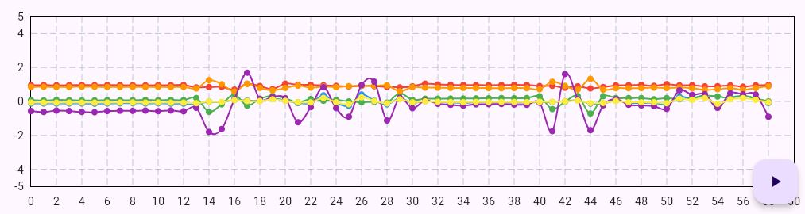

# ga_local_web_app

A Flutter web application for monitoring raw BMA400 sensor data.

## Overview

This application visualizes sensor data from the BMA400 sensor in real time, using a plot chart. The app is built with the Flutter SDK and leverages the following packages:

- **fl_chart:** For rendering line charts to visualize sensor data.
- **provider:** For state management across the application.
- **web_socket_channel:** For receiving real-time sensor data over a WebSocket connection.
- **path_provider:** For handling file paths and saving data locally.
- **csv:** For exporting data in CSV format.

## Features

- Real-time plotting of acceleration (`ax`, `ay`, `az`) and rotation (`rx`, `ry`, `rz`) data.
- Data is updated every 0.5 seconds.
- Easy management of data using Flutter's state management techniques.
- Export sensor data to a CSV file for offline analysis.

## Screen Preview

Below is a screenshot of the line chart displaying the sensor data (blue: `ax`, red: `ay`,green: `az`,orange: `rx`,purple: `ry`,yellow: `rz`) with a time step of 0.5 seconds.




## Getting Started

### Prerequisites

- Flutter SDK installed on your machine.
- Basic knowledge of Flutter development.
- A working WebSocket server providing BMA400 sensor data.

### Setup

1. Clone the repository:
    ```bash
     git clone https://github.com/your-repo/ga_local_web_app.git
    cd ga_local_web_app
2. Install dependencies:
    flutter pub get
3. Run the application:
    flutter run -d chrome

### Documentation

For more detailed guidance, refer to the following resources:

- Flutter Documentation
- fl_chart Documentation
- provider Documentation
- web_socket_channel Documentation
- path_provider Documentation
- csv Documentation

#### Contributions

Contributions are welcome! Feel free to open issues or submit pull requests.